# NXP Application Code Hub
[](https://www.nxp.com)

## This demo provides APIs to configure, read and write PCF2131 RTC.
<!-- *The title should clearly indicate what the example code does. If the example is for an application note, then the document reference (e.g. AN12345) should be appended at the beginning.* -->

This example provides CMSIS Compliant APIs to configure different operating modes of PCF2131 RTC. It also provides APIs to perform below mentioned operations:<br /><ul><li>RTC Start</li><li>RTC Stop</li><li>Get Time</li><li>Set Time</li><li>Get Recorded Timestamps on Switches</li><li>Software Reset </li></ul>

<!-- *Description should provide a clear explanation of what the code is for, and provide links to any related documentation. If documentation is included in the Github repo then its location should be mentioned here, along with the name of documentation file(s). If the code is a snippet/general software, then a sufficient description must be provided for a developer to fully understand the example, either in this readme or in another document in the repo.* -->

#### PCF2131-ARD RTC: Brief Introduction

<p align="justify"> The PCF2131 is a CMOS real time clock (RTC) and calendar with an integrated temperature compensated crystal (Xtal) oscillator (TCXO) and a 32.768 kHz quartz crystal optimized for very high accuracy and ultra-low power 
consumption. </p> 

#### PCF2131-ARD RTC: Key Features

- Selectable I2C-bus or SPI-bus interfaces for full flexibility when selecting the associated MCU/MPU. 
- Backup battery input and switch-over circuit, allowing the RTC to keep track of  the time, even when the main power supply is removed.
- Calendar capabilities to keep tracking of the time from years down to 1/100 seconds.
- Up to 4 timestamp registers, which can be associated to timestamp input in order to register tampering events.
- Up to 2 interrupt outputs to enable/disable systems to reduce the overall current consumption.

- The image below shows Sensors Development Ecosystem Offering:
 
  [](Sensors_Development_Ecosystem.png)

<!-- 
*Ask yourself - if you were finding this code for the first time, is there enough information to make it useful? Think **QUALITY**.* -->


#### Boards: FRDM-MCXN947
#### Categories: Sensor
#### Peripherals: SPI
#### Toolchains: MCUXpresso IDE

## Table of Contents
1. [Software](#step1)
2. [Hardware](#step2)
3. [Setup](#step3)
4. [Run Example Projects](#step4)
5. [Run PCF2131 Demo Example](#step5)
6. [FAQs](#step6)
7. [Support](#step7)
8. [Release Notes](#step8)

## 1. Software<a name="step1"></a>
- [IoT Sensing SDK (ISSDK) v1.8](https://nxp.com/iot-sensing-sdk) offered as middleware in MCUXpresso SDK for supported platforms
- [MCUXpresso IDE v11.9.0](https://www.nxp.com/design/design-center/software/development-software/mcuxpresso-software-and-tools-/mcuxpresso-integrated-development-environment-ide:MCUXpresso-IDE)


## 2. Hardware<a name="step2"></a>
- FRDM-MCXN947MCU board
- [PCF2131-ARD RTC Device](https://www.nxp.com/part/PCF2131-ARD#/) 
- Personal Computer
- Mini/micro C USB cable


## 3. Setup<a name="step3"></a>
### 3.1 Step 1: Download and Install required Software(s)
- Install MCUXpresso IDE 11.9.0 ((https://www.nxp.com/mcuxpresso/ide))
- Download and Install [MCUXpresso SDK v2.14.0 for FRDM-MCXN947](https://mcuxpresso.nxp.com/en/builder?hw=FRDM-MCXN947). Make sure to select ISSDK  middleware while building SDK.
- Install Git v2.39.0 (for cloning and running west commands)

### 3.2 Step 2: Clone the APP-CODE-HUB/dm-pcf2131-real-time-clock-driver-with-demo-app
- Clone this repository to get the example projects:
- Change directory to cloned project folder:<br>
    cd *dm-pcf2131-real-time-clock-driver-with-demo-app*

**Note:** If you are using Windows to clone the project, then please configure filename length limit using below command

**git config --system core.longpaths true**

### 3.3 Step 3: Build example projects
- Open MCUXpresso IDE and select a directory to create your workspace.
- Install MCXUpresso SDK 2.14.0 for FRDM-MCX947 (drag and drop SDK zip into "Installed SDK" view) into MCUXpresso IDE.
- Go to "Quickstart Panel" and click on "Import Project(s) from file system",
- Select "Project directory (unpacked)" and browse to the cloned project folder.
- Select example projects that you want to open and run.
- Right click on project and select build to start building the project.

<!-- *For training content you would usually refer the reader to the training workbook here.* -->
<!-- 
### 3.1 Step 1
```
code snippet to copy/paste to project
```

### 3.2 Step 2 -->

## 4. Run Example Projects<a name="step4"></a>
- Connect the chosen example project HW: FRDM-MCXN947 with PCF2131-ARD.
- Right click on project and select "Debug As". Select MCUXpresso IDE LinkServer (inc. CMSIS DAP) probes.
- Connect a USB cable between the host PC and the MCU-Link USB port on the target board.
- Either press the reset button on your board or launch the debugger in your IDE to begin running the demo.

## 5. Run PCF2131 Demo Example<a name="step5"></a>
 
- User need to check COM port after connecting USB cable between Host PC and Target Board via device manager.
 
[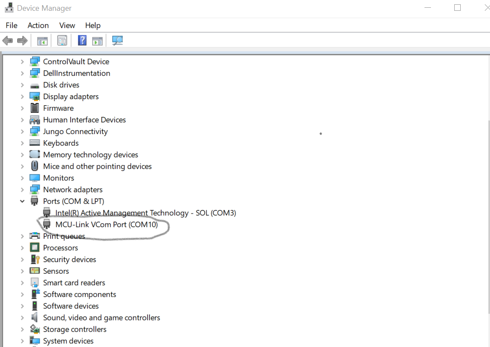](device_manager.png)
 
- Open PUTTY/Teraterm application installed on your Windows PC with Baudrate 115200 and assigned COM port as mentioned in above step.
 
[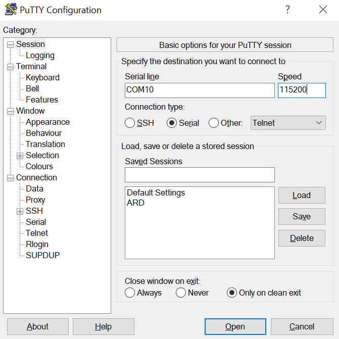](device_manager.png)
 
- After right click on project and select "Debug As", Demo application will run in interactive mode. When the demo runs successfully, you can see the logs printed on the terminal.

**LOGS:**

- **Main Menu:** Options displayed to use the RTC functions.

[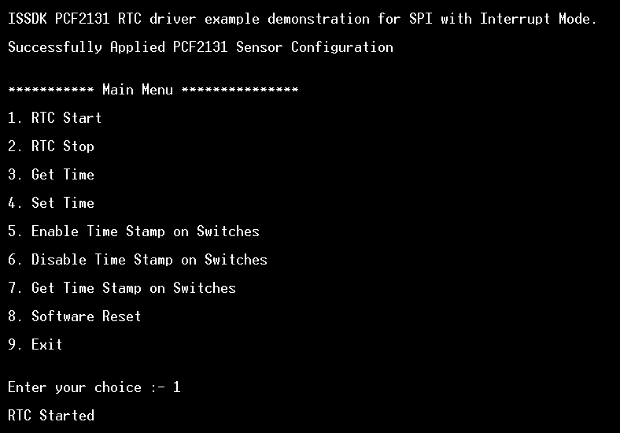](Main_Menu.png)

- **RTC Start:** To Start the Real Time Clock

[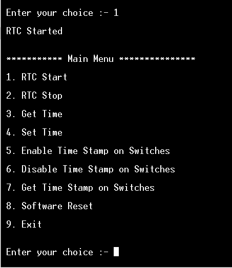](RTC_Start.png)

- **Set Time:** To Set Time in 12H/24H Mode and comes with feature to Enable/Disable
  Centi-Seconds (1/100th of a second or 10 milliseconds) Granularity.

[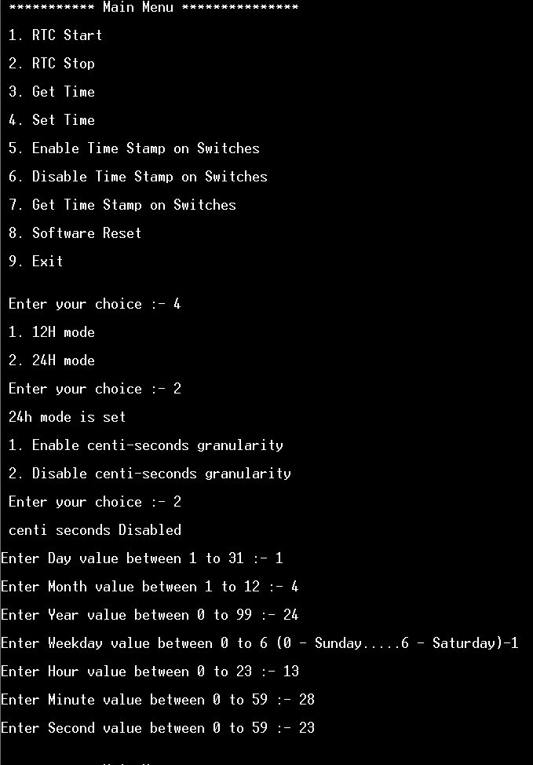](Set_Time.png)

- **Get Time:** To Get Time in 12H/24H Mode with feature of getting time in
  Centi-Seconds (1/100th of a second or 10 milliseconds) Granularity.

[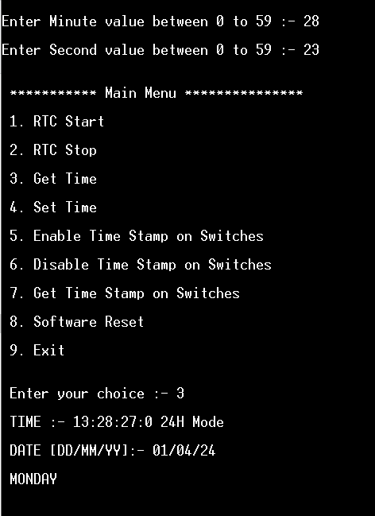](Get_Time.png)

- **Enable TimeStamp on Switches:** To enable Timestamp on switches (SW1/SW2/SW3/ SW4).  Please keep in mind after selecting the switch on which you have to 
record the timestamp, press that particular switch to enable timestamp recording functionality on PCF2131-ARD RTC.

[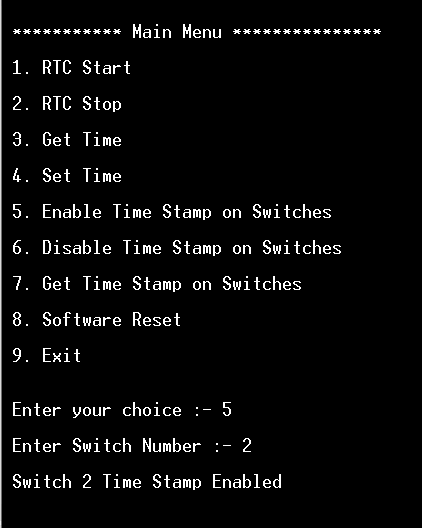](Enable_TimeStamps_On_Switches.png)

- **Get TimeStamp on Switches:** To get Timestamp on switches (SW1/SW2/SW3/SW4).

[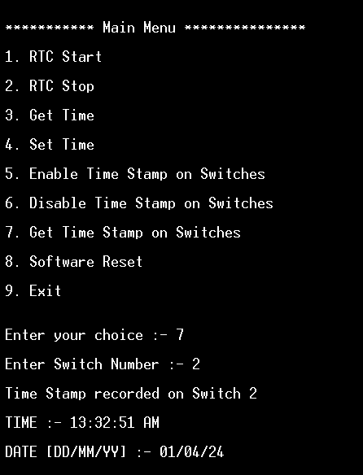](Get_TimeStamp_On_Switches.png)

- **Disable TimeStamp on Switches:** To disable Timestamp on switches (SW1/SW2/SW3/SW4).

[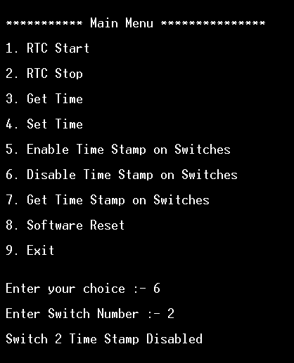](Disable_TimeStamp_On_Switches.png)

- **Software Reset:** Software Reset options comes with three options, first is to clear prescaler, second is to clear timestamps and third is complete software reset (which clears prescaler as well as clear timestamps)

[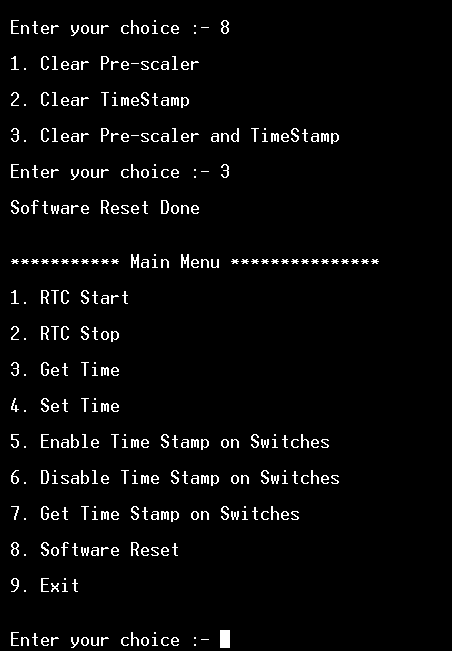](Software_Reset.png)

- **RTC Stop:** To Stop the Real Time Clock

[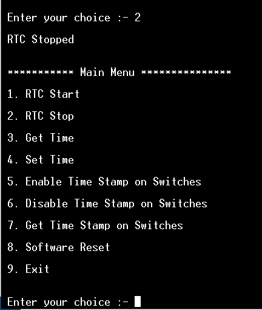](RTC_Stop.png)

## 6. FAQs<a name="step5"></a>
No FAQs have been identified for this project.

## 7. Support<a name="step6"></a>
*Provide URLs for help here.*

#### Project Metadata
<!----- Boards ----->
[](https://github.com/search?q=org%3Anxp-appcodehub+FRDM-MCXN947+in%3Areadme&type=Repositories)

<!----- Categories ----->
[](https://github.com/search?q=org%3Anxp-appcodehub+sensor+in%3Areadme&type=Repositories)

<!----- Peripherals ----->
[](https://github.com/search?q=org%3Anxp-appcodehub+spi+in%3Areadme&type=Repositories)

<!----- Toolchains ----->
[](https://github.com/search?q=org%3Anxp-appcodehub+mcux+in%3Areadme&type=Repositories)

Questions regarding the content/correctness of this example can be entered as Issues within this GitHub repository.

>**Warning**: For more general technical questions regarding NXP Microcontrollers and the difference in expected funcionality, enter your questions on the [NXP Community Forum](https://community.nxp.com/)

[](https://www.youtube.com/@NXP_Semiconductors)
[](https://www.linkedin.com/company/nxp-semiconductors)
[](https://www.facebook.com/nxpsemi/)
[](https://twitter.com/NXP)

## 8. Release Notes<a name="step7"></a>
| Version | Description / Update                           | Date                        |
|:-------:|------------------------------------------------|----------------------------:|
| 1.0     | Initial release on Application Code Hub        | March 28<sup>th</sup> 2024 |

