# NXP Application Code Hub
[](https://www.nxp.com)

## This demo provides APIs to configure, read and write PCF2131 RTC.
<!-- *The title should clearly indicate what the example code does. If the example is for an application note, then the document reference (e.g. AN12345) should be appended at the beginning.* -->

This example provides CMSIS Compliant APIs to configure different operating modes of PCF2131 RTC. It also provides APIs to perform below mentioned operations:<br /><ul><li>RTC Start</li><li>RTC Stop</li><li>Get Time</li><li>Set Time</li><li>Get Recorded Timestamps on Switches</li><li>Software Reset </li><li>Interrupt Functionality</li></ul>

<!-- *Description should provide a clear explanation of what the code is for, and provide links to any related documentation. If documentation is included in the Github repo then its location should be mentioned here, along with the name of documentation file(s). If the code is a snippet/general software, then a sufficient description must be provided for a developer to fully understand the example, either in this readme or in another document in the repo.* -->

#### PCF2131-ARD RTC: Brief Introduction

<p align="justify"> The PCF2131 is a CMOS real time clock (RTC) and calendar with an integrated temperature compensated crystal (Xtal) oscillator (TCXO) and a 32.768 kHz quartz crystal optimized for very high accuracy and ultra-low power 
consumption. </p> 

#### PCF2131-ARD RTC: Key Features

- Selectable I2C-bus or SPI-bus interfaces for full flexibility when selecting the associated MCU/MPU. 
- Backup battery input and switch-over circuit, allowing the RTC to keep track of  the time, even when the main power supply is removed.
- Calendar capabilities to keep tracking of the time from years down to 1/100 seconds.
- Up to 4 timestamp registers, which can be associated to timestamp input in order to register tampering events.
- Up to 2 interrupt outputs to enable/disable systems to reduce the overall current consumption.

- Real Time Clock Block Diagram:
 
  [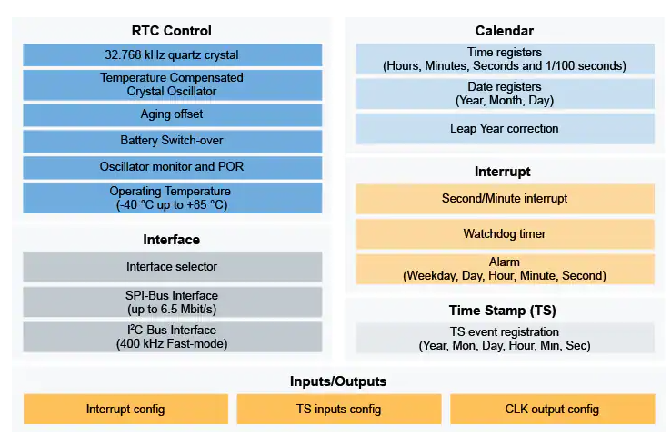](RTC_BD.png)

<!-- 
*Ask yourself - if you were finding this code for the first time, is there enough information to make it useful? Think **QUALITY**.* -->


#### Boards: FRDM-MCXN947 FRDM-MCXA153
#### Categories: RTC
#### Peripherals: SPI, I2C
#### Toolchains: MCUXpresso IDE

## Table of Contents
1. [Software](#step1)
2. [Hardware](#step2)
3. [Setup](#step3)
4. [Run Example Projects](#step4)
5. [Run PCF2131 Demo Example](#step5)
6. [FAQs](#step6)
7. [Support](#step7)
8. [Release Notes](#step8)


## 1. Software<a name="step1"></a>
- [IoT Sensing SDK (ISSDK) v1.8](https://nxp.com/iot-sensing-sdk) offered as middleware in MCUXpresso SDK for supported platforms
- [MCUXpresso IDE v11.9.0](https://www.nxp.com/design/design-center/software/development-software/mcuxpresso-software-and-tools-/mcuxpresso-integrated-development-environment-ide:MCUXpresso-IDE)


## 2. Hardware<a name="step2"></a>
- FRDM-MCXN947 MCU board
- [PCF2131-ARD RTC Device](https://www.nxp.com/part/PCF2131-ARD#/) 
- Personal Computer
- Mini/micro C USB cable


## 3. Setup<a name="step3"></a>
### 3.1 Step 1: Download and Install required Software(s)
- Install MCUXpresso IDE 11.9.0 ((https://www.nxp.com/mcuxpresso/ide))
- Download and Install [MCUXpresso SDK v2.14.0 for FRDM-MCXN947](https://mcuxpresso.nxp.com/en/builder?hw=FRDM-MCXN947). Make sure to select ISSDK  middleware while building SDK.
- Install Git v2.39.0 (for cloning and running west commands)

### 3.2 Step 2: Clone the APP-CODE-HUB/dm-pcf2131-real-time-clock-driver-with-demo-app
- Clone this repository to get the example projects:
- Change directory to cloned project folder:<br>
    cd *dm-pcf2131-real-time-clock-driver-with-demo-app*

**Note:** If you are using Windows to clone the project, then please configure filename length limit using below command.

**git config --system core.longpaths true**

### 3.3 Step 3: Build example projects
- Open MCUXpresso IDE and select a directory to create your workspace.
- Install MCXUpresso SDK 2.14.0 for FRDM-MCX947 (drag and drop SDK zip into "Installed SDK" view) into MCUXpresso IDE.
- Go to "Quickstart Panel" and click on "Import Project(s) from file system",
- Select "Project directory (unpacked)" and browse to the cloned project folder.
- Select example projects that you want to open and run.
- Right click on project and select build to start building the project.

<!-- *For training content you would usually refer the reader to the training workbook here.* -->
<!-- 
### 3.1 Step 1
```
code snippet to copy/paste to project
```

### 3.2 Step 2 -->

## 4. Run Example Projects<a name="step4"></a>
- Connect the chosen example project HW: FRDM-MCXN947 with PCF2131-ARD.
- Right click on project and select "Debug As". Select MCUXpresso IDE LinkServer (inc. CMSIS DAP) probes.
- Connect a USB cable between the host PC and the MCU-Link USB port on the target board.
- Either press the reset button on your board or launch the debugger in your IDE to begin running the demo.

Note 1: For selecting communication interface, Change:
- I2C_ENABLE to 1 under rtc/pcf2131.h for I2C
- I2C_ENABLE to 0 under rtc/pcf2131.h for SPI

Note 2: By default SPI/I2C Controller operates in interrupt mode,
       to switch into EDMA mode Change:
- RTE_I2C2_DMA_EN to 1 under board/RTE_Device.h for I2C
- RTE_SPI1_DMA_EN to 1 under board/RTE_Device.h for SPI

## 5. Run PCF2131 Demo Example<a name="step5"></a>
 
- User need to check COM port after connecting USB cable between Host PC and Target Board via device manager.
 
[](device_manager.png)
 
- Open PUTTY/Teraterm application installed on your Windows PC with Baudrate 115200 and assigned COM port as mentioned in above step.
 
[](device_manager.png)
 
- After right click on project and select "Debug As", Demo application will run in interactive mode. When the demo runs successfully, you can see the logs printed on the terminal.

**LOGS:**

- **Main Menu will look like this**

[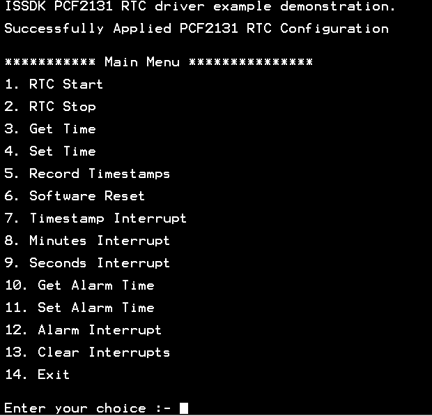](LOG1.png)

- **Enter #1 to Start RTC** 

[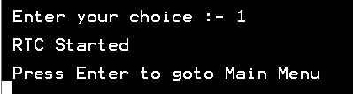](LOG2.png)

- **Enter #4 to Set Time and choose respective sub-options**

[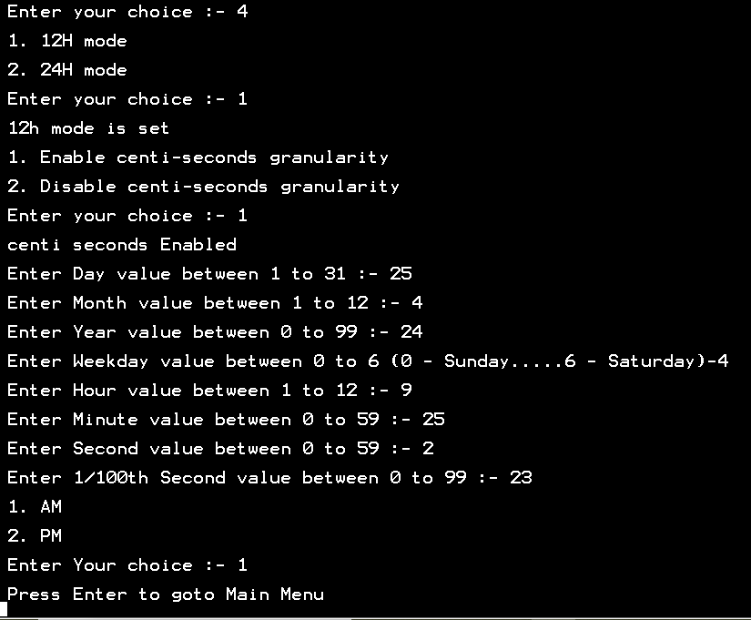](LOG3.png)

- **Enter #5 to Get Time** 

[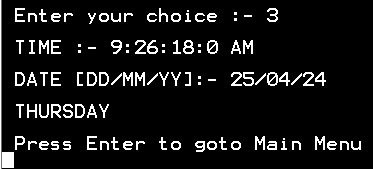](LOG4.png)

- **Enter #5 to Record Timestamps on Switches:**  

[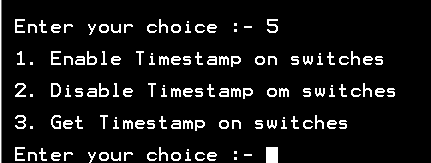](LOG5.png)

    a) Enter sub-option #1 to Enable Timestamp on SW2: 

    NOTE: Press SW2 on PCF2131-ARD to enable Timestamp.
      
[](LOG6.png)

    b) Enter sub-option #2 Disable Timestamp on SW2: 

[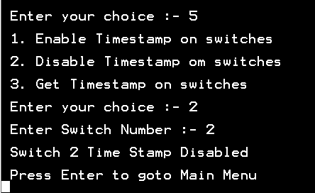](LOG7.png)

    c) Enter sub-option #3 to Get Timestamp: 

[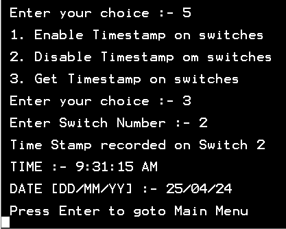](LOG8.png)

- **Use any option (7,8,9,12) to Enable Interrupts:**  


[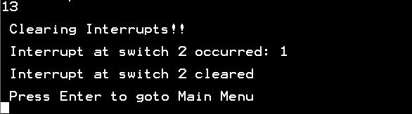](LOG13.png)

    a) Steps to Enable Timestamp Interrupt: 

       Timestramp interrrupt is generated on pressing SW1-SW4.

       Below are the steps to Enable timestamp interrupt for SW2:

        Step1: Enter #7 to Enable Timestamp Interrupt

[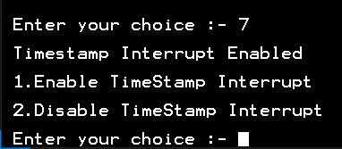](LOG9.png)

        Step2: Enter #2 to select SW2

[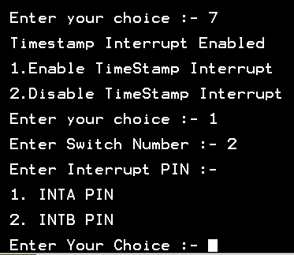](LOG10.png)

        Step3: Choose any one Interrupt Pin and Press Enter

[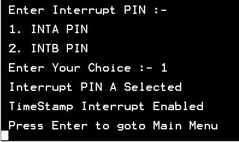](LOG11.png)
	
	Step4: Press Switch number on which interrupt is enabled to
               get the interrupt
[](LOG12.png)

- **Enter #13 to Clear Interrupt:** 

[](LOG13.png)


## 6. FAQs<a name="step5"></a>
No FAQs have been identified for this project.

## 7. Support<a name="step6"></a>
*Provide URLs for help here.*

#### Project Metadata
<!----- Boards ----->
[](https://github.com/search?q=org%3Anxp-appcodehub+FRDM-MCXN947+in%3Areadme&type=Repositories)
[](https://github.com/search?q=org%3Anxp-appcodehub+FRDM-MCXA153+in%3Areadme&type=Repositories)

<!----- Categories ----->
[](https://github.com/search?q=org%3Anxp-appcodehub+sensor+in%3Areadme&type=Repositories)

<!----- Peripherals ----->
[](https://github.com/search?q=org%3Anxp-appcodehub+i2c+in%3Areadme&type=Repositories) [](https://github.com/search?q=org%3Anxp-appcodehub+sensor+in%3Areadme&type=Repositories)


<!----- Toolchains ----->
[](https://github.com/search?q=org%3Anxp-appcodehub+mcux+in%3Areadme&type=Repositories)

Questions regarding the content/correctness of this example can be entered as Issues within this GitHub repository.

>**Warning**: For more general technical questions regarding NXP Microcontrollers and the difference in expected funcionality, enter your questions on the [NXP Community Forum](https://community.nxp.com/)

[](https://www.youtube.com/@NXP_Semiconductors)
[](https://www.linkedin.com/company/nxp-semiconductors)
[](https://www.facebook.com/nxpsemi/)
[](https://twitter.com/NXP)

## 8. Release Notes<a name="step7"></a>
| Version | Description / Update                           | Date                        |
|:-------:|------------------------------------------------|----------------------------:|
| 1.0     | Initial release on Application Code Hub        | March 28<sup>th</sup> 2024 |
| 2.0     | Additional features for PCF2131 on FRDM-MCXN947 and Complete features for PCF2131 on FRDM-MCXA153      | April 30<sup>th</sup> 2024 |
| 3.0     | Fixed Bugs related to EDMA for FRDM-MCXN947 & FRDM-MCXA153     | May 30<sup>th</sup> 2024 |
